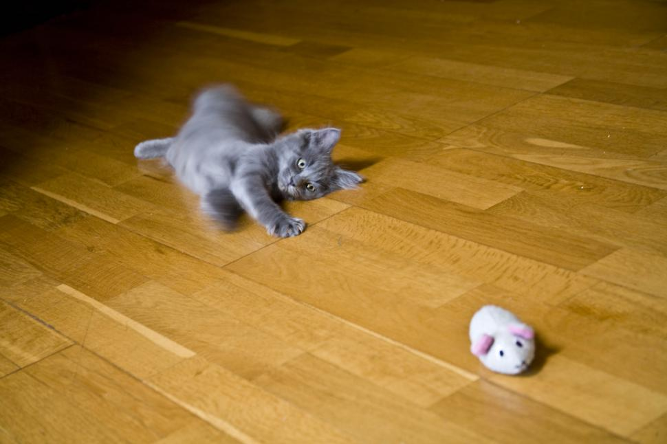

 **We are looking for new PhD students, Postdocs, and Master students to join the lab [email us](mailto:takiyama@miami.edu)** **!**

## Staff   
   
_Tasuku Akiyama, PhD_  
Associate Professor  
Neuroscience Program Faculty  
Human Genetics Genomics Program Faculty  
Director of Animal Studies at the Miami Itch Center  

_Darya Pavlenko, PhD_  
Postdotoral Reseracher  










  
  <h4>{{ member.name }}</h4>
  <i>{{ member.info }} email: <{{ member.email }}></i>
  <ul style="overflow: hidden">

  
  <li> {{ member.education1 }} </li>
  

  
  <li> {{ member.education1 }} </li>
  <li> {{ member.education2 }} </li>
  

  
  <li> {{ member.education1 }} </li>
  <li> {{ member.education2 }} </li>
  <li> {{ member.education3 }} </li>
  

  
  <li> {{ member.education1 }} </li>
  <li> {{ member.education2 }} </li>
  <li> {{ member.education3 }} </li>
  <li> {{ member.education4 }} </li>
  

  
  <li> {{ member.education1 }} </li>
  <li> {{ member.education2 }} </li>
  <li> {{ member.education3 }} </li>
  <li> {{ member.education4 }} </li>
  <li> {{ member.education5 }} </li>
  

  </ul>














## PhD Students   
 

## Master Students   
     

## Undergraduate Students   
_Hilary Shapiro_

_Ariana Lopez_ 










  <h4>{{ member.name }}</h4>
  <i>{{ member.info }} email: <{{ member.email }}></i>
  <ul style="overflow: hidden">

  
  <li> {{ member.education1 }} </li>
  

  
  <li> {{ member.education1 }} </li>
  <li> {{ member.education2 }} </li>
  

  
  <li> {{ member.education1 }} </li>
  <li> {{ member.education2 }} </li>
  <li> {{ member.education3 }} </li>
  

  
  <li> {{ member.education1 }} </li>
  <li> {{ member.education2 }} </li>
  <li> {{ member.education3 }} </li>
  <li> {{ member.education4 }} </li>
  

  </ul>













   
   
## Alumni
_Zeynep Todurga, PhD_  
Postdoctoral Researcher

_Hirotake Ishida, PhD_  
Postdoctoral Researcher

_Anika Markan_
Undergraduate student

_Hoor A Javed_
Master student 

_Kent Sakai, PhD_  
Entry Scientist  

_Hideki Funahashi, MD/PhD_  
Postdoctoral Researcher   

_Gabriella Guerriero_   
Undergraduate student

_Taisa Lozada_   
Undergraduate student

_Kristen Sanders, PhD_  
Neuroscience Program   

_Anita Oladunni, BS_   
Master student  

_Tyler Henry_    
Undergraduate student

_Marina Youssef_    
Undergraduate student

_Yoshihiro Inami, PhD_    
Postdoctoral Researcher 

_Kevin Yanushefski_    
Medical student










  
  <h4>{{ member.name }}</h4>
  <i>{{ member.duration }}   Role: {{ member.info }}</i>
  <ul style="overflow: hidden">

  </ul>














