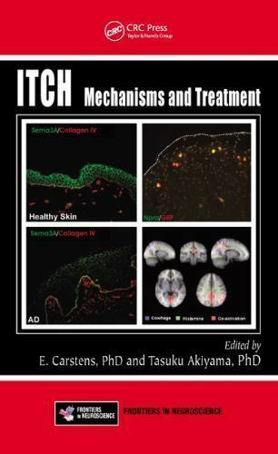

\*Authors contributed equally 

Members of the Akiyama laboratory indicated in _italic_  

# _Journal Articles_    
## 2024
[Activation of NPY2R-expressing amygdala neurons inhibits itch behavior in mice without lateralization](https://pubmed.ncbi.nlm.nih.gov/39333236/)  
_Pavlenko D_, _Todurga-Seven ZG_, _Sanders KM_, _Markan A_, _Verpile R_, _Ishida H_, _Costo D_, _Akiyama T_.
Sci Rep. 2024 Sep 27;14(1):22125.

[Cryosim-1: A Cool Solution for Acute and Chronic Itch](https://pubmed.ncbi.nlm.nih.gov/38593191/)           
_Pavlenko D_, _Akiyama T_.
Br J Dermatol. 2024 May 17;190(6):787.

## 2023
[Dynorphinergic projections from the central amygdala to the parabrachial nucleus regulate itch](https://pubmed.ncbi.nlm.nih.gov/37399333/)  
_Funahashi H_, _Pavlenko D_, _Sakai K_, _Verpile R_, _Sanders KM_, _Akiyama T_.
Acta Derm Venereol. 2023 Aug 22:103:adv13382.

[Crisaborole Inhibits Itch and Pain in Atopic Dermatitis by Preventing Neutrophil Infiltration](https://pubmed.ncbi.nlm.nih.gov/37605895/)  
_Pavlenko D_, _Todurga Z_, _Bystrom L_, _Markan A_, _Verpile R_, _Ishida H_, _Akiyama T_.
Acta Derm Venereol. 2023 Aug 22:103:adv13382.

[Enhancement of allyl isothiocyanate-evoked responses of mouse trigeminal ganglion cells by the kokumi substance γ-glutamyl-valyl-glycine (γ-EVG) through activation of the calcium-sensing receptor (CaSR)](https://pubmed.ncbi.nlm.nih.gov/36563734/)  
_Akiyama T_, Curtis E, Carstens MI, Carstens E. 
Physiol Behav. 2023 Mar;1:260:114063.

[Pellino1 restricts herpes simplex virus infections in the epidermis and dissemination to sebaceous glands](https://pubmed.ncbi.nlm.nih.gov/36216205/)  
Cai Q, Shelhamer C, _Akiyama T_, Jensen LE. 
J Invest Dermatol. 2023 Apr;143(4):639-647.

## 2021
[Crisaborole prevents infiltration of neutrophils to suppress itch in a mouse model of atopic dermatitis](https://journals.lww.com/itch/Fulltext/2021/04010/Crisaborole_prevents_infiltration_of_neutrophils.5.aspx)  
_Sakai K_, _Sanders KM_, _Pavlenko D_, _Lozada T_, _Akiyama T_.
Itch. 2021 Apr;6(2):e53.

## 2020
[IL-23 modulates histamine-evoked itch and responses of pruriceptors in mice](https://pubmed.ncbi.nlm.nih.gov/33010057/)  
_Pavlenko D_, _Funahashi H_, _Sakai K_, Hashimoto T, _Lozada T_, Yosipovitch G, _Akiyama T_.
Exp Dermatol. 2020 Dec;29(12):1209-1215.

[Low-threshold mechanosensitive VGLUT3-lineage sensory neurons mediate spinal inhibition of itch by touch](https://pubmed.ncbi.nlm.nih.gov/32895292/)  
_Sakai K_, _Sanders KM_, Lin SH, _Pavlenko D_, _Funahashi H_, _Lozada T_, Hao S, Chen CC, _Akiyama T_.
J Neurosci. 2020 Sep 30;40(40):7688-7701

[Protease-activated receptor-2 Regulates Neuro-epidermal Communication in Atopic Dermatitis](https://pubmed.ncbi.nlm.nih.gov/32903402/)  
Buhl T, Ikoma A, Kempkes C, Cevikbas F, Sulk M, Buddenkotte J, _Akiyama T_, Crumrine D, Camerer E, Carstens E, Schön MP, Elias P, Coughlin SR, Steinhoff M. Frontiers in Immunology, 2020 Aug 12;11:1740 

[New insights into the mechanisms behind mechanical itch](https://pubmed.ncbi.nlm.nih.gov/32621303/)  
_Sakai K_, _Akiyama T_.
Exp Dermatol. 2020 Aug;29(8):680-686.

## 2019
[Signal Transducer and Activator of Transcription 3 in Keratinocytes Regulates Histaminergic Itch but Not Nonhistaminergic Itch](https://pubmed.ncbi.nlm.nih.gov/31141156/?from_term=akiyama+itch&from_sort=date&from_pos=1)   
Hashimoto T, _Sakai K_, Yosipovitch G, _Akiyama T_. Acta Derm Venereol. 2019 Sep 1;99(10):901-902. 

[A Subpopulation of Amygdala Neurons Mediates the Affective Component of Itch](https://pubmed.ncbi.nlm.nih.gov/30819800/?from_term=akiyama+itch&from_sort=date&from_pos=3)    
_Sanders KM_, _Sakai K_, _Henry TD_, Hashimoto T, _Akiyama T_.
J Neurosci. 2019 Apr 24;39(17):3345-3356. 

[Disinhibition of Touch-Evoked Itch in a Mouse Model of Psoriasis](https://pubmed.ncbi.nlm.nih.gov/30571971/?from_term=akiyama+itch&from_sort=date&from_pos=4)    
_Sakai K_, _Akiyama T_.
J Invest Dermatol. 2019 Jun;139(6):1407-1410. 

[Antipruritic Effects of Janus Kinase Inhibitor Tofacitinib in a Mouse Model of Psoriasis](https://pubmed.ncbi.nlm.nih.gov/30460374/?from_term=akiyama+itch&from_sort=date&from_pos=5)   
Hashimoto T, _Sakai K_, _Sanders KM_, Yosipovitch G, _Akiyama T_.
Acta Derm Venereol. 2019 Mar 1;99(3):298-303.

## 2018
[Opposing effects of cervical spinal cold block on spinal itch and pain transmission](https://pubmed.ncbi.nlm.nih.gov/34136640/) 
Carstens E, Carstens MI, _Akiyama T_, Davoodi A, Nagamine M.
Itch. 2018 Sep;3(3):e16. 

[Modulation of Itch by Localized Skin Warming and Cooling](https://pubmed.ncbi.nlm.nih.gov/29972224/?from_term=akiyama+itch&from_sort=date&from_pos=7) 
_Sanders KM_, Hashimoto T, _Sakai K_, _Akiyama T_.
Acta Derm Venereol. 2018 Oct 10;98(9):855-861. 

[Effects of Pruritogens and Algogens on Rostral Ventromedial Medullary ON and OFF Cells](https://pubmed.ncbi.nlm.nih.gov/29947594/?from_term=akiyama+itch&from_sort=date&from_pos=8)
 
Follansbee T, _Akiyama T_, Fujii M, Davoodi A, Nagamine M, Iodi Carstens M, Carstens E.
J Neurophysiol. 2018 Nov 1;120(5):2156-2163.

[Peripheral Gabapentin Regulates Mosquito Allergy-Induced Itch in Mice](https://pubmed.ncbi.nlm.nih.gov/29842875/?from_term=akiyama+itch&from_sort=date&from_pos=9)
 
_Akiyama T_, Andoh T, Ohtsuka E, Nojima H, Ouchi H, Takahata H, Kuraishi Y.
Eur J Pharmacol. 2018 Aug 15;833:44-49.

## 2017

[Role of Neurturin in Spontaneous Itch and Increased Nonpeptidergic Intraepidermal Fiber Density in a Mouse Model of Psoriasis](https://pubmed.ncbi.nlm.nih.gov/28825602/?from_term=akiyama+itch&from_sort=date&from_page=2&from_pos=2) 
_Sakai K_, _Sanders KM_, _Youssef MR_, _Yanushefski KM_, Jensen LE, Yosipovitch G, _Akiyama T_.
Pain. 2017 Nov;158(11):2196-2202.

[Differing Intrinsic Biological Properties Between Forebrain and Spinal Oligodendroglial Lineage Cells](https://pubmed.ncbi.nlm.nih.gov/28512742/?from_term=akiyama+itch&from_sort=date&from_page=2&from_pos=4)
 
Horiuchi M, Suzuki-Horiuchi Y, _Akiyama T_, Itoh A, Pleasure D, Carstens E, Itoh T.
J Neurochem. 2017 Aug;142(3):378-391.

[Expression of Histidine Decarboxylase in the Epidermis of Primates With Chronic Itch](https://pubmed.ncbi.nlm.nih.gov/27805719/?from_term=akiyama+itch&from_sort=date&from_page=2&from_pos=7)
 
_Inami Y_, Nattkemper LA, _Sakai K_, Yosipovitch G, _Akiyama T_.
Acta Derm Venereol. 2017 Jun 9;97(6):739-740.

[Innocuous Warming Enhances Peripheral Serotonergic Itch Signaling and Evokes Enhanced Responses in Serotonin-Responsive Dorsal Horn Neurons in the Mouse](https://pubmed.ncbi.nlm.nih.gov/27784810/?from_term=akiyama+itch&from_sort=date&from_page=2&from_pos=8)
 
_Akiyama T_, Nagamine M, Davoodi A, Ivanov M, Carstens MI, Carstens E.
J Neurophysiol. 2017 Jan 1;117(1):251-259.

## 2016

[Mouse Model of Imiquimod-Induced Psoriatic Itch](https://pubmed.ncbi.nlm.nih.gov/27437787/?from_term=akiyama+itch&from_sort=date&from_page=2&from_pos=9)
 
_Sakai K_, _Sanders KM_, _Youssef MR_, _Yanushefski KM_, Jensen L, Yosipovitch G, _Akiyama T_.
Pain. 2016 Nov;157(11):2536-2543.

[Involvement of TRPV4 in Serotonin-Evoked Scratching](https://pubmed.ncbi.nlm.nih.gov/26763435/?from_term=akiyama+itch&from_sort=date&from_page=3&from_pos=1)
 
_Akiyama T_, Ivanov M, Nagamine M, Davoodi A, Carstens MI, Ikoma A, Cevikbas F, Kempkes C, Buddenkotte J, Steinhoff M, Carstens E.
J Invest Dermatol. 2016 Jan;136(1):154-160.

[Anatomical Evidence of Pruriceptive Trigeminothalamic and Trigeminoparabrachial Projection Neurons in Mice](https://pubmed.ncbi.nlm.nih.gov/26099199/?from_term=akiyama+itch&from_sort=date&from_page=3&from_pos=4)
 
_Akiyama T_, Curtis E, Nguyen T, Carstens MI, Carstens E.
J Comp Neurol. 2016 Feb 1;524(2):244-56.

[## publications (~2015)](https://www.researchgate.net/profile/Tasuku_Akiyama)

# _Review Articles_

[Why Does Stress Aggravate Itch? A Possible Role of the Amygdala](https://pubmed.ncbi.nlm.nih.gov/30991457/?from_term=akiyama+itch&from_sort=date&from_pos=2)     
_Pavlenko D_, _Akiyama T_. Exp Dermatol. 2019 Dec;28(12):1439-1441.

[Alloknesis and Hyperknesis-Mechanisms, Assessment Methodology, and Clinical Implications of Itch Sensitization](https://pubmed.ncbi.nlm.nih.gov/29659469/?from_term=akiyama+itch&from_sort=date&from_pos=10)
 Andersen HH, _Akiyama T_, Nattkemper LA, van Laarhoven A, Elberling J, Yosipovitch G, Arendt-Nielsen L.
Pain. 2018 Jul;159(7):1185-1197.

[The Vicious Cycle of Itch and Anxiety](https://pubmed.ncbi.nlm.nih.gov/29374516/?from_term=akiyama+itch&from_sort=date&from_page=2&from_pos=1)
 
_Sanders KM_, _Akiyama T_.
Neurosci Biobehav Rev. 2018 Apr;87:17-26. 

[Central Mechanisms of Itch](https://pubmed.ncbi.nlm.nih.gov/27578065/?from_term=akiyama+itch&from_sort=date&from_page=2&from_pos=10)
 
Carstens E, _Akiyama T_.
Curr Probl Dermatol. 2016;50:11-7.

[Neural Processing of Itch](https://pubmed.ncbi.nlm.nih.gov/23891755/?from_term=akiyama+itch&from_sort=date&from_page=4&from_pos=9)
 
_Akiyama T_, Carstens E.
Neuroscience. 2013 Oct 10;250:697-714.

# _Book_
   

“Itch: Mechanisms and Treatment”, CRC Press. 2014
_Akiyama T_, and Carstens E. (Eds.) 

# _Book Chapters_
“Affective and Reward Pathways in Itch Processing” in “The Neurological and Immunological Basis of Itch and Dermatological Disorders” Dong X, Kim B, and Follansbee T (Eds). Elsevier 2025   
_Pavlenko D_, and _Akiyama T_.

“Current Understanding of Itch Neural Networks and Circuitry in the Brain” in “Histaminergic and Non-Histaminergic Itch: From Channels to Behavior” Tsagareli M (Ed), Hauppauge, New York: Nova Science Publishers, Inc. 43-58, 2023    
_Pavlenko D_, and _Akiyama T_.

“Preclinical models of itch and pain” in “Itch and Pain: Similarities, Interactions, and Differences” Yosipovitch G, Andersen HH, and Arendt-Nielsen L (Eds). International Association for the Study of Pain (IASP) Press. 2020   
_Sanders KM_, and _Akiyama T_.

“Serotonin receptors in pain and itch processing” in “Itch and Pain: Similarities, Interactions, and Differences” Yosipovitch G, Andersen HH, and Arendt-Nielsen L (Eds). International Association for the Study of Pain (IASP) Press. 2020   
_Kent S_, _Sanders KM_, and _Akiyama T_. 

“Alloknesis and hyperknesis: sensitization for itch” in “Hyperalgesia and Allodynia” Tsagareli M (Ed), Hauppauge, New York: Nova Science Publishers, Inc. 25-62, 2018   
_Sanders KM_, and _Akiyama T_.

“Cutaneous Neurophysiology” in “4th edition Dermatology” Bolognia JL, Schaffer JV and Cerroni L (Eds), Elsevier 5: 1-11, 2017   
Yosipovitch G, and _Akiyama T_. 

"Central Mechanisms of Itch" in "Itch-Management in Clinical Practice" Szepietowski JC and Weisshaar E (Eds.), Karger 50:11-7, 2016   
_Akiyama T_, and Carstens E. 

“Neural Processing of Itch” in “Pruritus, Second Edition” Laurent Misery and Sonja Stander (Eds.), Springer 3-11, 2016   
_Akiyama T_, and Carstens E.

“Protease-activated receptors and itch” in “Handbook of Experimental Pharmacology-Pharmacology of Itch” Cowan A and Yosipovitch G. (Eds.), Springer 226:219-235, 2015   
_Akiyama T_, Lerner EA, and Carstens E. 

“Spinal processing of itch and pain” in “Recent evidence of itch and pain” Yasushi Kuraishi (Eds.) in Japanese, Shinko Trading Company Ltd., Publication Department of Medical Books. Pain Clinic. 34(4): 493-504, 2013   
_Akiyama T_

“Assessment of chemically-evoked itch in rodents” in “Pain Models: Translational Relevance and Applications” Hermann O Handwerker (Eds.), IASP press 403-414, 2013   
_Akiyama T_, and Carstens E.

