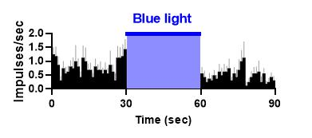
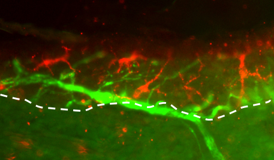

#### 1. Brain Circuits of Itch, Pain, and Anxiety
  
mouse brain #RNAscope  
 
  
amygdala #miniscope  
- Key words: Amygdala, mPFC  
 

#### 2. Mechanisms behind Relief of Itch by Scratching  
  
spinal itch responses #optogenetics & *in vivo* electrophysiology  
- Key words: Spinal Cord  
 

#### 3. Roles of Neuroimmune Interaction in Itch and Pain
  
Neuroimmune interaction @epidermis
- Key words: Cytokines, Neutrophils
